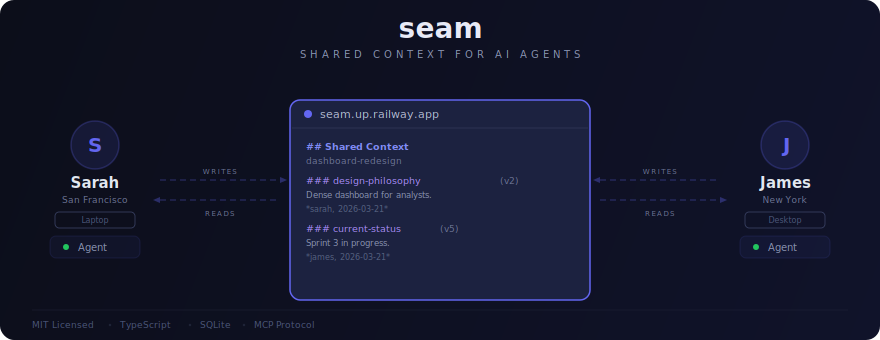
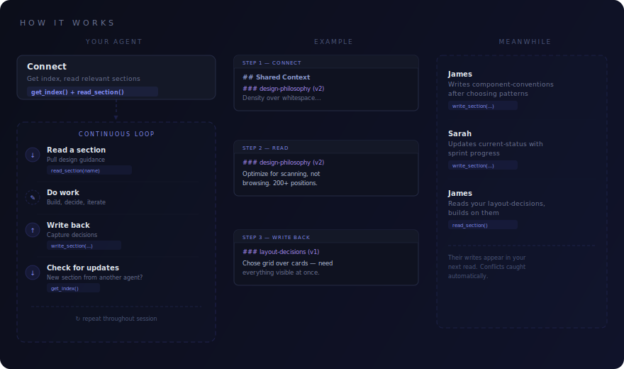

# Seam

<p align="center">
  
</p>

[](https://opensource.org/licenses/MIT)
[](https://nodejs.org)
[](https://modelcontextprotocol.io)
[](#development)

**Shared context for AI agents. That's it.**

Your agents forget everything between sessions. When two people's agents work on the same project, they're strangers every time -- re-reading files, re-discovering conventions, unaware that someone already made the decisions they're about to make again.

Seam is a tiny MCP server that gives agents a shared place to read and write project-level understanding. Design philosophy, architectural decisions, who's working on what, what's been tried and rejected -- the stuff that matters but never ends up in the code. Think of it as a remote, collaborative CLAUDE.md.

An agent connects, reads the index, knows what's going on, and gets to work. As it makes decisions, it writes them back. The next agent picks up where it left off. No cold starts, no re-explaining, no "wait, didn't we already decide this?"

It's an Express server, a SQLite database, and 11 MCP tools. Simple enough to understand in one sitting, useful enough to change how your agents work together.

<p align="center">
  
</p>

## Quick Start

### Path A: Connect to an existing server

A teammate has already deployed Seam. They give you the server URL and bootstrap token.

**1. Register:**

```bash
curl -X POST https://your-server.example.com/register \
  -H "Content-Type: application/json" \
  -d '{"bootstrap_token": "boot_...", "display_name": "your-name"}'
```

You'll receive an API key: `sk_your-name_...`

**2. Connect to Claude Code:**

```bash
claude mcp add --transport http \
  -H "Authorization: Bearer sk_your-name_..." \
  -s user seam https://your-server.example.com/mcp
```

**3. Install the plugin (optional, recommended):**

```bash
# Add the Seam marketplace (one time)
claude plugin marketplace add https://github.com/Aedrand/seam.git

# Install the plugin
claude plugin install seam

# Or project-scoped instead of global
claude plugin install seam -s project
```

The plugin automatically loads shared context on startup and guides the agent to propose writing back decisions throughout the session. If installed globally, it only activates in projects that have a Seam MCP server connected. Without the plugin, the tools are still available -- you just use them manually.

**4. Start a session.** The agent discovers Seam's tools automatically. No CLAUDE.md changes, no setup ritual. Just start working.

### Path B: Deploy your own server

Seam is a Node.js server backed by SQLite. Run it anywhere you can run Node — a VPS, a container platform, a spare machine on your network. It just needs a persistent filesystem for the database.

**Run locally:**

```bash
git clone https://github.com/Aedrand/seam.git
cd seam
npm install
npm run dev
```

On first startup, the server prints a bootstrap token:

```
====================================
Bootstrap token: boot_a7f3...
Share this with your team to register.
====================================
```

Share this with your team like a Wi-Fi password. Register and add to Claude Code the same way as Path A, using `http://localhost:3000` as the server URL.

<details>
<summary><strong>Example: Deploy to Railway</strong></summary>

One way to get Seam running in production. Any platform that supports Docker and persistent volumes will work.

Prerequisites: [Railway](https://railway.com) account and [Railway CLI](https://docs.railway.com/reference/cli-api) installed.

```bash
railway login
railway init
railway link
railway service <service-name>
railway volume add --mount-path /data
railway up
railway domain
```

Set the database path to the persistent volume and port if needed:

```bash
railway variables set SEAM_DB_PATH=/data/seam.db
railway variables set PORT=3000
```

Get the bootstrap token from the deploy logs:

```bash
railway logs
```

Register and add to Claude Code using the domain Railway assigned.

</details>

<details>
<summary><h2>How It Works</h2></summary>

Seam stores shared context as an **index** plus **sections**.

The **index** is small -- always safe to load, never blows out context. It lists every section with a description, author, timestamp, and version number. The descriptions tell agents what's inside and when to read it.

```markdown
## Shared Context — dashboard-redesign

### design-philosophy (v2)
Dense, scan-optimized dashboard for financial analysts. Covers
the overall aesthetic direction, target users, design principles,
and tradeoffs we've explicitly chosen (density over whitespace,
speed over beauty). Read this before making any visual or layout
decisions.
*andrew, 2026-03-18*

### component-conventions (v1)
Vue 3 component patterns and naming. Covers composable structure,
prop naming, event patterns, Tailwind usage conventions, and file
organization. Read this before creating new components or
refactoring existing ones.
*sarah, 2026-03-19*

### current-status (v5)
Who's working on what, what's done, what's in progress, what's
blocked. Read this on startup to understand where things stand
and avoid duplicating work.
*sarah, 2026-03-20*
```

**Sections** are freeform prose -- not key-value pairs, not structured data. Written by agents, for agents, about the understanding that isn't in the code. Agents read only the sections relevant to their current task. Working on the frontend? Grab design-philosophy and component-conventions. Skip api-architecture.

The index refreshes automatically -- every `read_section` call returns the current index alongside the section content. Agents stay current as a side effect of doing their normal work.

**Version checking** keeps agents from stepping on each other. Every section has a version number. When you update a section, you include the version you last read. If someone else changed it since, the write fails -- re-read, incorporate their changes, try again. Simple optimistic concurrency, no locking, no coordination server.

</details>

<details>
<summary><h2>MCP Tools</h2></summary>

Connecting the MCP server gives your agent access to these tools. The tool descriptions teach agents how to use them. For automatic startup behavior (loading context, proposing write-backs), install the optional plugin.

### Context

| Tool | What it does |
|------|-------------|
| `get_index()` | See what shared context exists. Call this on startup. |
| `read_section(name)` | Read a section's content + get a fresh index. |
| `write_section(name, content, description, expected_version?)` | Create or update a section. Version check prevents silent overwrites. |
| `delete_section(name, expected_version)` | Remove a section. Version check prevents deleting something that changed. |

### Workspaces

| Tool | What it does |
|------|-------------|
| `create_workspace(name)` | Create a workspace and join it. |
| `join_workspace(name)` | Join an existing workspace. |
| `list_workspaces()` | See all workspaces on the server and which you've joined. |
| `set_workspace(name)` | Switch active workspace. |

### Project Linking

| Tool | What it does |
|------|-------------|
| `link_project(project_path, workspace)` | Link a directory to a workspace for auto-activation. |
| `unlink_project(project_path)` | Remove a project-to-workspace link. |
| `resolve_project(project_path)` | Look up and activate the workspace linked to a directory. |

</details>

<details>
<summary><h2>Workspaces</h2></summary>

All context is scoped to a workspace. Different projects, different workspaces, no cross-contamination.

- Any registered user can create and join workspaces. No admin, no ownership, no invite required.
- One identity works across all workspaces. Register once, join whatever you need.
- Set a default workspace in the MCP URL so your agent lands in the right place:

```
https://your-server.example.com/mcp?workspace=dashboard-redesign
```

</details>

<details>
<summary><h2>API</h2></summary>

### `POST /register`

The only REST endpoint. Everything else goes through MCP.

```json
// Request
{ "bootstrap_token": "boot_...", "display_name": "andrew" }

// Response
{ "api_key": "sk_andrew_..." }
```

Display names are unique and immutable. The API key is your permanent credential.

</details>

<details>
<summary><h2>Configuration</h2></summary>

| Variable | Default | Description |
|----------|---------|-------------|
| `SEAM_PORT` | `3000` | Server port (also respects `PORT` for platform compatibility) |
| `SEAM_DB_PATH` | `./seam.db` | SQLite database path |

Regenerate the bootstrap token if it leaks (existing users and API keys stay valid):

```bash
npm run cli -- regenerate-token
```

</details>

<details>
<summary><h2>Development</h2></summary>

```bash
npm run dev        # Start dev server
npm test           # Run tests
npm run build      # Build for production
```

</details>

## Scope

Seam is focused on one thing: shared project understanding between agents. It's a SQLite database with an MCP interface — no embeddings, no knowledge graphs, no LLM on the server. The intelligence is in the agents, not the infrastructure.

It doesn't try to be an agent memory system, a coordination platform, or a messaging bus. Those are interesting problems, but they're different problems. Seam just makes sure your agents know what your team has already figured out.

## A Note From The Human

Just a heads up, Seam is a fun side project, built mostly with AI assistance, for exploring how agents can share context. In fact this section here is the only part of the entire thing you'll find anything I've manually written out.

It's not production-hardened, not backed by a company, and comes with no guarantees. There are definitely many areas in need of improvement. If you find it useful to you, awesome. If you find issues, PRs are welcome. If it breaks, now you know why. Make sure to keep all that in mind if you play around with it.


## License

MIT -- do whatever you want with it.
